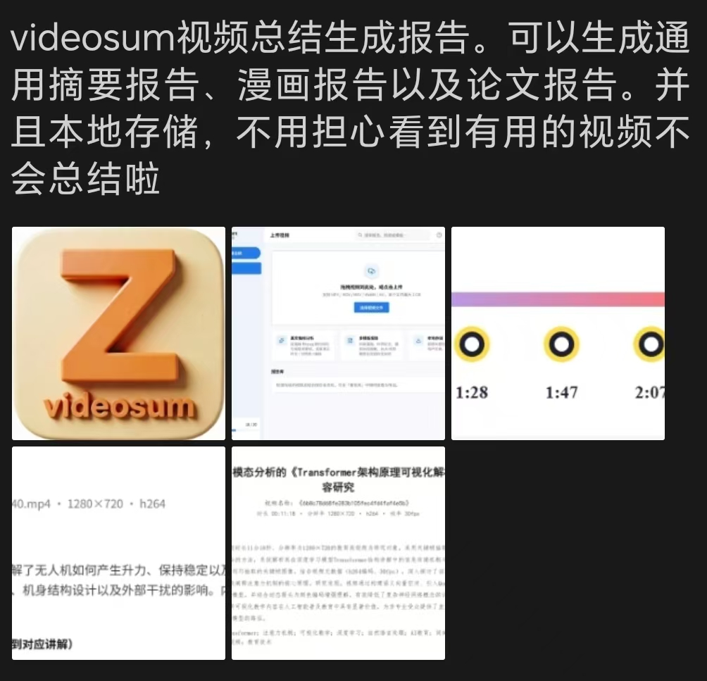

# VideoSum · 视频转图文报告工具

[](./LICENSE)

把一段视频变成**可以读的图文报告**。上传视频后，VideoSum 会自动抽帧、调用你配置的 AI 视觉模型分析画面，并生成三种不同风格的总结：**通用摘要**（图文讲解）、**漫画分镜**（趣味科普）、**论文报告**（学术风，可导出 DOCX）。

所有视频和报告都**存储在本地**，不上传任何第三方服务器 —— 隐私优先。



## ✨ 功能特性

- **通用摘要报告**：顶部是完整的关键帧时间轴，每一段用 Markdown 图文讲解对应画面；点击任意关键帧即可下滑到对应讲解。
- **漫画分镜报告**：科普 / 趣味视频自动做成一页「漫画书」，每个分镜带旁白、对话、角色、拟声词，最少 6 格。
- **论文报告**：仿学术期刊排版，含摘要、关键词、数据概览、逐帧详解、关键技术分析，支持 **一键导出 DOCX**。
- **本地优先**：视频、抽帧、报告全部存在本地，报告库可随时回看。
- **多模态 AI 视觉模型**：接入 OpenAI 兼容的视觉模型（如通义千问 VL-Max、GPT-4o）后，逐帧解读由模型真实分析画面生成；未配置时自动降级为结构化简述，不影响使用。
- **关键帧时间轴跳转**：报告顶部的关键帧缩略图与下方讲解一一对应，点击即定位。

## 📥 下载

> ⚠️ **请务必从本仓库的 Releases 页面下载安装包，不要从源码文件区找 `.exe`。**
>
> 仓库里**不包含**安装包（构建产物被 `.gitignore` 排除，避免体积过大导致无法推送）。安装包只通过 GitHub Releases 分发。

1. 打开本仓库的 **Releases** 页面。
2. 展开最新版本的 **Assets**。
3. 下载 `VideoSum Setup x.x.x.exe`。
4. 双击安装即可。

> 安装包**未做代码签名**，Windows 可能弹出 SmartScreen「已保护你的电脑」提示。这是未签名程序的正常提示，点击「仍要运行 / 更多信息 → 仍要运行」即可正常安装。

## 🛠 从源码构建

### 环境要求

- Node.js **22+**
- [ffmpeg](https://ffmpeg.org/) 与 ffprobe（需加入系统 `PATH`）
- Git

### 步骤

```bash
# 1. 克隆仓库
git clone https://github.com/<your-username>/videosum.git
cd videosum

# 2. 安装依赖
npm install

# 3. 打包（会先编译前端/后端，再用 electron-builder 生成安装包）
npm run pack
```

打包完成后，安装包位于 `release/VideoSum Setup x.x.x.exe`，可直接双击安装。

> 若只想在本地临时运行测试版（不生成安装包），可用 `npm run dev:build` 生成 `release/win-unpacked` 绿色版。

## ⚙️ 配置 AI 视觉模型

VideoSum 的「逐帧画面解读」依赖一个多模态视觉模型。在应用内 **设置** 中填入：

- **API Base URL**：你的模型服务地址（OpenAI 兼容格式，如 `https://dashscope.aliyuncs.com/compatible-mode/v1`）
- **API Key**：对应平台的密钥
- **模型名**：如 `qwen-vl-max`、`gpt-4o`

未配置时，报告仍会生成（使用结构化简述兜底）；配置后，逐帧解读会由模型真实分析每一张关键帧画面。

## 🧱 技术栈

- **桌面框架**：Electron 43
- **前端**：React 18 + TypeScript + Vite 5 + Tailwind CSS
- **后端**：Express（内置 HTTP 服务，处理上传 / 抽帧 / 调用视觉模型 / 报告存储）
- **媒体处理**：ffmpeg / ffprobe
- **报告导出**：docx

## 📄 许可证

[MIT](./LICENSE) © 2026 VideoSum
